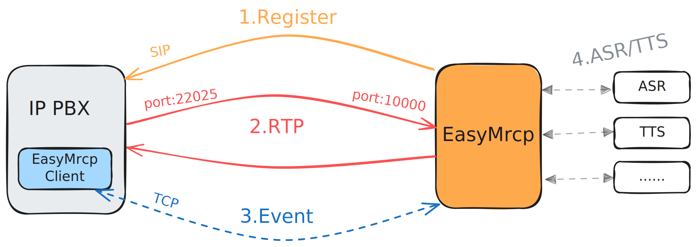
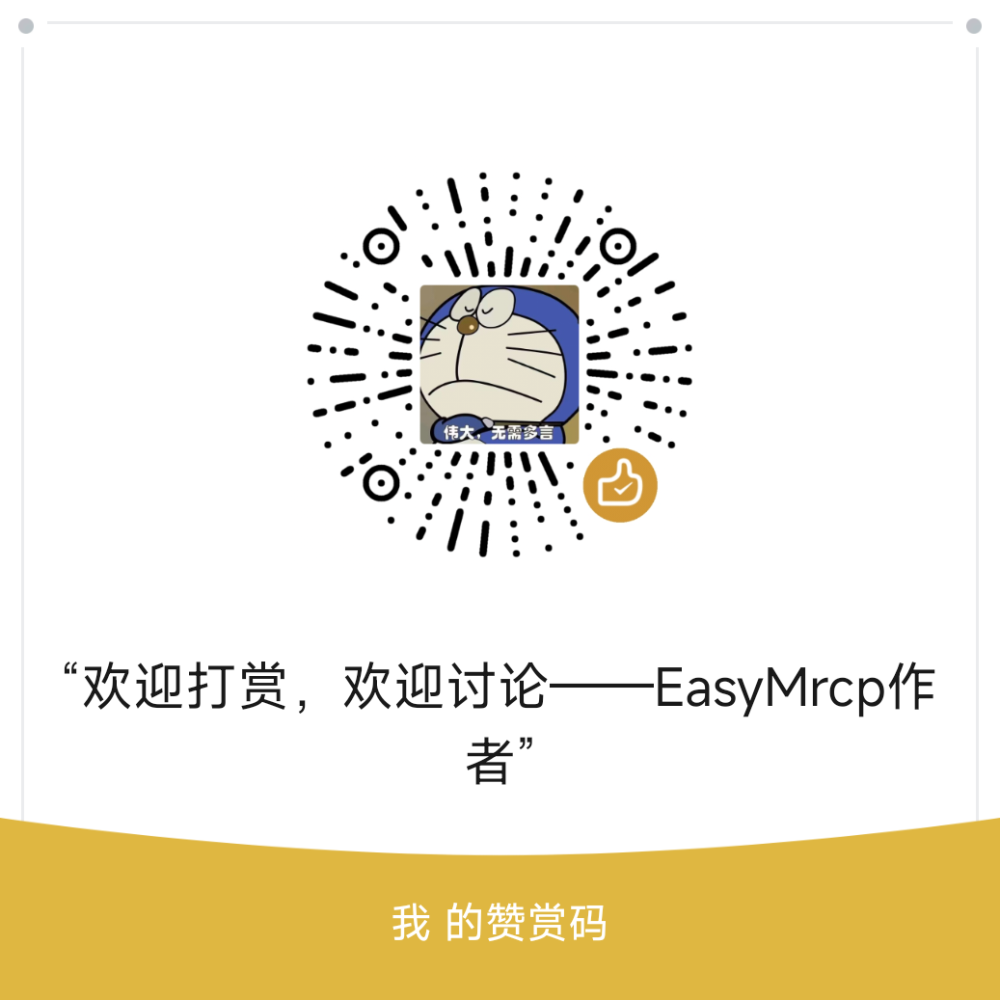

# 简介
欢迎使用EasyMrcp！

EasyMrcp使用java编写，目前提供了多种不同的asr和tts的集成，做到真正简单使用ASR和TTS。

现已推出最新架构2.0，已全面放弃原mrcp协议，取而代之的是简化实现的完全异步架构，部分功能正在完善中.......

> [!CAUTION]  
重要提示：从2.0版本开始已经不再支持使用标准mrcp协议，项目中已完全删除标准mrcp相关内容，也不再需要安装mod_unimrcp模块等操作。取而代之的是全新架构。</font>
>

# 项目演示
视频演示：【【EasyMrcp 2.0】VoIP中集成ASR/TTS的语音服务器】 [https://www.bilibili.com/video/BV1gGhhzeEf1/?share_source=copy_web&vd_source=5ff73fb9e66e524e8dde009d51927426](https://www.bilibili.com/video/BV1gGhhzeEf1/?share_source=copy_web&vd_source=5ff73fb9e66e524e8dde009d51927426)

# 目前支持
项目迭代中，后续会集成更多的asr和tts服务。划掉部分为旧版集成部分，现正逐步实现适配中，欢迎提出指正问题。

| 电话软交换平台 |  |
| --- | --- |
| freeswitch | 支持 |


| ASR | 支持的asr模式 | 简介 |
| --- | --- | --- |
| funAsr | 实时语音转写 | 阿里开源，免费可离线运行的asr，地址：[https://github.com/modelscope/FunASR](https://github.com/modelscope/FunASR) |
| xfyun | ~~实时语音转写~~、一句话语音识别 | 科大讯飞在线asr服务，每天有免费额度。一句话语音识别：[https://www.xfyun.cn/services/voicedictation](https://www.xfyun.cn/services/voicedictation)   长时间实时语音转写：[https://www.xfyun.cn/services/rtasr](https://www.xfyun.cn/services/rtasr) |
| ~~tencent-cloud~~ | ~~实时语音转写~~ | ~~目前使用EasyMrcp以一句话识别的模式集成的实时语音识别：~~<br/>[~~https://cloud.tencent.com/document/product/1093/52554~~](https://cloud.tencent.com/document/product/1093/52554) |


| TTS | 支持的tts模式 | 简介 |
| --- | --- | --- |
| kokoro | 流式 | 离线的tts服务，开源免费，使用FastAPI项目：[https://github.com/remsky/Kokoro-FastAPI](https://github.com/remsky/Kokoro-FastAPI) |
| xfyun | 流式 | 科大讯飞在线tts服务，每天有免费额度。地址：[https://www.xfyun.cn/services/online_tts](https://www.xfyun.cn/services/online_tts) |
| ~~tencent-cloud~~ | ~~流式~~ | ~~实时语音合成：~~[~~https://cloud.tencent.com/document/product/1093/52554~~](https://cloud.tencent.com/document/product/1093/52554) |


# 新版架构升级
自EasyMrcp 2.0开始，不再使用标准mrcp协议，使用**sip注册方式**+**类似mrcp交互命令**+**简单客户端控制**来完成ASR和TTS交互。

新架构强调了**用户**与**智能语音机器人**之间是一通电话的概念，本质上用户拨打智能语音机器人就像用户打给另一个用户进行通话一样。



## SIP注册方式
采用EasyMrcp直接向IPPBX注册方式，通话时相当于SIP的UA，也就是说可以将EasyMrcp看作一个语音网关，IPPBX通过SIP协议控制通话生命周期，通过自定义头方式传递通话必要的参数。抛弃了原mrcp协议中依靠mrcp client进行sip交互的方式。

## **类似mrcp交互命令**
mrcp协议是控制ASR和TTS的关键命令，新版中保留了mrcp的关键特征，自定义了类似mrcp事件的简单协议，简化了mrcp事件的设计。在代码使用上与旧mrcp使用基本没有差异，但更符合使用习惯。

## **简单客户端控制**
EasyMrcp client简化到只负责ASR和TTS的命令交互，新版中大幅降低了client的复杂程度。现在client优化为一个简单的tcp连接发送相关事件，提供了简单的代码封装。如果您想要其他语言版本的client，那么简单的客户端设计可以让您利用ai根据一个客户端的代码去写出自己想要的语言的客户端代码，让异构架构集成EasyMrcp变得更加简单。

## 完全异步
彻底解决了旧架构中无法异步调用的问题，现在在同一通电话中可以在**任意时间任意线程任意代码位置**控制ASR和TTS，可以理解为EasyMrcp是面向语音流的，只是通过命令控制向语音流中插入相关操作。

# 旧版本问题
下面介绍了在旧版中使用的核心痛点，这也是为什么坚定要推出新版的原因。

## 整体架构问题
以unimrcp对接freeswtich为例，VoIP语音流流向是这样的：

ASR:`freeswtich -> mrcp client -> mrcp server`

TTS:`mrcp server -> mrcp client -> freeswtich`

在流程上mrcp client中转了VoIP语音流。mrcp协议规定了使用sip完成tts和asr操作，可以理解为mrcp client是ASR和TTS的总代理，由它来控制由会话建立、每轮mrcp对话、语音流处理等繁重的交互过程。由于mrcp在设计层面实际上侧重的是单轮对话，也就是一次ASR和TTS的过程。所以mrcp的设计中ASR是由命令触发的，TTS是每次都会通过sip协商一个新的rtp流，10轮对话就会前后产生10条RTP流。所以可以看出mrcp本意上是将asr和tts看作一个功能，让每通电话去主动调用方法完成交互，弱化了用户与智能语音机器人之间复杂语音流的通话概念。

## mod_unimrcp客户端限制太多
在EasyMrcp 2.0之前的版本是使用`mod_unimrcp`作为mrcp客户端使用，但是由于mrcp的本质上是基于一轮对话的结构设计的，所以导致需要循环执行`play_and_detect_speech`等命令，这将会导致多轮对话间命令发送出现间隙等问题。另外在客户端在异步执行方面存在着诸多限制，无法异步的通过多线程方式去正确操作多轮对话的，导致出现卡顿等情况。在客户端事件设计方面没有暴露出更多原mrcp协议中的中间状态等事件，降低了处理复杂对话的可行性。在异构语言方面，执行效果不尽相同，python脚本的部分命令执行存在问题，并不能达到lua脚本相同的效果。

## unimrcp需手动集成
在EasyMrcp 1.x的版本中主要完成的就是集成问题，可使用EasyMrcp替换unimrcp，虽然存在很多不完善的地方，但是提供了开箱即用的asr和tts集成。

# 下载程序
下载发布的压缩包，目前版本正在迭代中，如果发版不及时可以自己切换至dev分支maven编译运行项目。

# 更多文档支持
更多文档正在完善中......

地址：[https://www.yuque.com/u2521223237/ribhhy/zm88s62ykxcd1znr?singleDoc#](https://www.yuque.com/u2521223237/ribhhy/zm88s62ykxcd1znr?singleDoc#) 《EasyMrcp 2.0——VoIP中集成ASR/TTS的语音服务器》

## 交互事件
目前尚未完全完善文档，后续将会补充完整设计。

[https://www.yuque.com/u2521223237/ribhhy/funo3eogpgw7lg8b?singleDoc#](https://www.yuque.com/u2521223237/ribhhy/funo3eogpgw7lg8b?singleDoc#) 《EasyMrcp事件》

## 版本更新
[https://www.yuque.com/u2521223237/ribhhy/elfdnvv06e8rha1b?singleDoc#](https://www.yuque.com/u2521223237/ribhhy/elfdnvv06e8rha1b?singleDoc#) 《版本更新》

## VAD
[https://www.yuque.com/u2521223237/ribhhy/gwhi60g6w01heubu?singleDoc#](https://www.yuque.com/u2521223237/ribhhy/gwhi60g6w01heubu?singleDoc#) 《VAD模型参数》

# 运行程序
以下配置只是为了能够体验EasyMrcp，所以存在一些硬编码情况，在实际使用中可以根据自己的项目情况进行不同的配置。

## 前置准备
1. 项目运行需要JDK11。
2. 使用FreeSwitch作为IP PBX
3. 使用python作为执行脚本(需要freeswtich支持python)
4. 演示用EasyMrcp client脚本需要安装python tcp库`gevent`：  
   安装与 FreeSWITCH 中所用 Python 版本兼容的版本（例如，Python 2.7）  
   `pip install gevent==1.4.0 greenlet==0.4.17`

## 必要的配置
### 配置EasyMrcp配置文件
请选择要使用的一种asr和tts进行对应配置。

1. 修改EasyMrcp服务器配置，设置运行ip和对接的服务类型，以下配置以科大讯飞asr和tts为例。  
   配置项目目录下的`application.yaml`文件，主要需要修改的配置如下：  
   配置`sipServer`EasyMrcp运行的ip地址。  
   配置`asrMode`选择一个asr服务名称。  
   配置`ttsMode`选择一个tts服务名称。  
   配置`fs.server`、`fs.domain`为freeswtich地址。  
   配置EasyMrcp要注册的号码`fs.username`、`fs.password`，根据sip实际开号情况。

```plain
sip:
  # EasyMrcp要监听的sip服务器地址，填写项目运行的ip地址
  sipServer: 192.168.31.29
mrcp:
  # 选择一个asr服务，目前已经集成：xfyun、funasr
  asrMode: xfyun
  # 选择一个tts服务，目前已经集成：xfyun、kokoro
  ttsMode: xfyun
# FreeSWITCH注册配置
fs:
  register:
    # 是否启用FreeSWITCH注册
    enabled: true
    # FreeSWITCH服务器IP
    server: 172.16.2.119
    # FreeSWITCH SIP端口
    port: 5060
    # 注册用户名
    username: 1020
    # 注册密码
    password: 1020
    # 注册域
    domain: 172.16.2.119
    # 注册间隔(秒)
    interval: 1800
```

2. 配置asr配置文件。  
   下面以配置科大讯飞asr为例，配置项目目录下的`asr/xfyun-asr.properties`。  
   示例使用科大讯飞的实时语音听写功能，需要配置科大讯飞的密钥等信息。  
   配置`xfyun-asr.APPID=`科大讯飞控制台appid。  
   配置`xfyun-asr.APISecret=`科大讯飞控制台secret。  
   配置`xfyun-asr.APIKey=`科大讯飞控制台key。  
   其余选项暂时不用修改。

```plain
####################################语音听写(流式版)####################################
# 地址与鉴权信息
xfyun-asr.host-url=https://iat-api.xfyun.cn/v2/iat
# 均到控制台-语音合成页面获取
xfyun-asr.APPID=
xfyun-asr.APISecret=
xfyun-asr.APIKey=
# (必须) 配置asr语音识别模式: dictation(一句话语音识别) 或者 transliterate(长时间语音转写)
xfyun-asr.identify-patterns=dictation


####################################实时语音转写####################################
## 地址与鉴权信息
#xfyun-asr.host-url=rtasr.xfyun.cn/v1/ws
## 均到控制台-语音合成页面获取
#xfyun-asr.APPID=
#xfyun-asr.APIKey=
## (必须) 官方只支持16kHz音频，所以需要重采样（请勿随意修改）
#xfyun-asr.re-sample=upsample8kTo16k
## (必须) 配置asr语音识别模式: dictation(一句话语音识别) 或者 transliterate(长时间语音转写)
#xfyun-asr.identify-patterns=transliterate
```

3. 配置tts配置文件。  
   下面以配置科大讯飞asr为例，配置项目目录下的`xfyun-tts.properties`。  
   示例使用科大讯飞的在线语音合成功能，需要配置科大讯飞的密钥等信息。  
   配置`xfyun-tts.APPID=`科大讯飞控制台appid。  
   配置`xfyun-tts.APISecret=`科大讯飞控制台secret。  
   配置`xfyun-tts.APIKey=`科大讯飞控制台key。  
   其余选项暂时不用修改。

```plain
# 地址与鉴权信息
xfyun-tts.host-url=https://tts-api.xfyun.cn/v2/tts
# 均到控制台-语音合成页面获取
xfyun-tts.APPID=
xfyun-tts.APISecret=
xfyun-tts.APIKey=
# 小语种必须使用UNICODE编码作为值
xfyun-tts.TTE=UTF8
# 发音人参数。到控制台-我的应用-语音合成-添加试用或购买发音人，添加后即显示该发音人参数值，若试用未添加的发音人会报错11200
xfyun-tts.VCN=xiaoyan
```

### 脚本配置
下面以Freeswitch为例进行配置，目的是演示EasyMrcp的使用，实际情况可根据自己的项目配置进行更改。注意要安装python tcp的`gevent`库。

1. 配置拨号计划  
   在/usr/local/freeswitch/conf/dialplan/default.xml里新增如下配置：

```plain
<?xml version="1.0" encoding="utf-8"?>
<include>
  <context name="default">
    <!-- 新增拨号计划，让所有号码都执行mrcp_handler脚本 -->
    <extension>
      <condition field="destination_number" expression="^\d+$">
        <action application="python" data="mrcp_handler"/>
      </condition>
    </extension>

  </context>
</include>

```

2. 添加python执行脚本  
   在/usr/local/freeswitch/scripts目录下新增`mrcp_handler.py`脚本和`tcp_client.py`脚本。脚本文件可以在下载的项目根目录下的`scripts`中找到。  
   `tcp_client.py`是EasyMrcp client的python版本，只需调用即可。  
   `mrcp_handler.py`包含用户与EasyMrcp电话之间的桥接和EasyMrcp client的简单调用。  
   在`mrcp_handler.py`中修改硬编码的EasyMrcp地址，将`server_host`改为EasyMrcp的运行地址。

```plain
    # 硬编码MRCP服务器信息
    server_host = "172.16.2.155"
    server_port = 9090
```

### 命令运行
正常运行项目，使用如下命令：

`java -jar EasyMrcp-x.x.x.jar`

使用随意号码拨打号码1020(之前配置中EasyMrcp注册的号码)即可听到欢迎语，后续可以进行多轮的对话，EasyMrcp会重复你的话。

# 联系我
加入QQ群：


# 赞助
如果您觉得EasyMrcp还算好用，或许可以打赏作者，这将用于EasyMrcp整体建设中~



