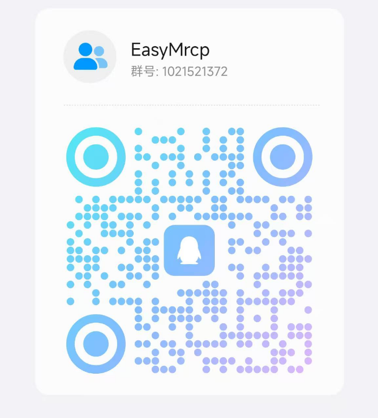

# 简介
欢迎使用EasyMrcp！

EasyMrcp使用java编写，目前提供了多种不同的asr和tts的集成，做到真正简单使用MRCP。

可直接替代UniMrcp，部分功能正在完善中.......

# 目前支持
项目迭代中，后续会集成更多的asr和tts服务，欢迎提出指正问题。

| 电话软交换平台 |  |
| --- | --- |
| freeswitch | 支持 |


| ASR | 支持的asr模式 | 简介 |
| --- | --- | --- |
| funAsr | 实时语音转写 | 阿里开源，免费可离线运行的asr，地址：[https://github.com/modelscope/FunASR](https://github.com/modelscope/FunASR) |
| xfyun | 实时语音转写、一句话语音识别 | 科大讯飞在线asr服务，每天有免费额度。一句话语音识别：[https://www.xfyun.cn/services/voicedictation](https://www.xfyun.cn/services/voicedictation)   长时间实时语音转写：[https://www.xfyun.cn/services/rtasr](https://www.xfyun.cn/services/rtasr) |
| tencent-cloud | 实时语音转写 | 目前使用EasyMrcp以一句话识别的模式集成的实时语音识别：[https://cloud.tencent.com/document/product/1093/52554](https://cloud.tencent.com/document/product/1093/52554) |


| TTS | 支持的tts模式 | 简介 |
| --- | --- | --- |
| kokoro | 流式 | 离线的tts服务，开源免费，使用FastAPI项目：[https://github.com/remsky/Kokoro-FastAPI](https://github.com/remsky/Kokoro-FastAPI) |
| xfyun | 流式 | 科大讯飞在线tts服务，每天有免费额度。地址：[https://www.xfyun.cn/services/online_tts](https://www.xfyun.cn/services/online_tts) |
| tencent-cloud | 流式 | 实时语音合成：[https://cloud.tencent.com/document/product/1093/52554](https://cloud.tencent.com/document/product/1093/52554) |


# 更多文档支持
更多文档正在完善中......

地址：[https://www.yuque.com/u2521223237/ribhhy/ta8q9vekgd02d6zo?singleDoc#](https://www.yuque.com/u2521223237/ribhhy/ta8q9vekgd02d6zo?singleDoc#) 《EasyMrcp》

# 下载程序
下载发布的jar包，目前版本正在迭代中，如果发版不及时可以自己maven编译运行项目。

# 运行程序
## 前置准备
项目运行需要JDK11

## 必要的配置
### 配置项目运行文件
也可以参考别人提供的配置方法：[https://github.com/reSipWebRTC/UniMRCP-with-freeswitch](https://github.com/reSipWebRTC/UniMRCP-with-freeswitch)

配置FreeSWITCH

我们需要将处理用户语音呼入的FreeSWITCH与向EasyMrcp两者连接起来。

1. 配置unimrcp模块并自动加载；

```plain
# 编辑/usr/local/src/freeswitch/modules.conf文件，找到要安装的模块，去掉前面的注释符号#
cd /usr/local/src/freeswitch
vim modules.conf
#asr_tts/mod_unimrcp
asr_tts/mod_unimrcp

# 执行make mod_xxx-install命令，这样就编译相应模块，并把编译后的动态库安装的/usr/local/freeswitch/mod目录下
make mod_unimrcp-install

# 编辑/usr/local/freeswitch/conf/autoload_configs/modules.conf.xml，去掉注释符号，如果没有发现对应模块，则添加
<load module="mod_unimrcp"/>
```

2. 设置profile文件与conf文件；

在/usr/local/freeswitch/conf/mrcp_profiles目录新建unimrcpserver-mrcp-v2.xml配置文件：

```plain
<include>
  <!-- UniMRCP Server MRCPv2 -->
  <!-- 后面我们使用该配置文件，均使用 name 作为唯一标识，而不是文件名 -->
  <profile name="unimrcpserver-mrcp2" version="2">
    <!-- MRCP 服务器地址 -->
    <param name="server-ip" value="192.168.1.23"/>
    <!-- MRCP SIP 端口号 -->
    <param name="server-port" value="8060"/>

    <!-- FreeSWITCH IP、端口以及 SIP 传输方式 -->
    <param name="client-ip" value="192.168.1.24" />
    <param name="client-port" value="5069"/>
    <param name="sip-transport" value="udp"/>

    <!--param name="rtp-ext-ip" value="auto"/-->
    <param name="rtp-ip" value="192.168.1.24"/>
    <param name="rtp-port-min" value="4000"/>
    <param name="rtp-port-max" value="5000"/>
    <param name="codecs" value="PCMU PCMA L16/96/8000"/>

    <!-- Add any default MRCP params for SPEAK requests here -->
    <synthparams>
    </synthparams>

    <!-- Add any default MRCP params for RECOGNIZE requests here -->
    <recogparams>
      <!--param name="start-input-timers" value="false"/-->
    </recogparams>
  </profile>
</include>
```

配置/usr/local/freeswitch/conf/autoload_configs/unimrcp.conf.xml文件：

```plain
<configuration name="unimrcp.conf" description="UniMRCP Client">
  <settings>
    <!-- UniMRCP profile to use for TTS -->
    <param name="default-tts-profile" value="unimrcpserver-mrcp2"/>
    <!-- UniMRCP profile to use for ASR -->
    <param name="default-asr-profile" value="unimrcpserver-mrcp2"/>
    <!-- UniMRCP logging level to appear in freeswitch.log.  Options are:
         EMERGENCY|ALERT|CRITICAL|ERROR|WARNING|NOTICE|INFO|DEBUG -->
    <param name="log-level" value="DEBUG"/>
    <!-- Enable events for profile creation, open, and close -->
    <param name="enable-profile-events" value="false"/>

    <param name="max-connection-count" value="100"/>
    <param name="offer-new-connection" value="1"/>
    <param name="request-timeout" value="3000"/>
  </settings>

  <profiles>
    <X-PRE-PROCESS cmd="include" data="../mrcp_profiles/*.xml"/>
  </profiles>

</configuration>
```

注：1.unimrcpserver-mrcp-v2.xml中server-ip为EasyMrcp启动的主机ip；2.client-ip和rtp-ip为FreeSWITCH启动的主机，client-port仕FreeSWITCH作为客户端访问unimrcpserver的端口，手机作为客户端访问的FreeSWITCH端口默认为5060，两者不同；3.unimrcpserver-mrcp-v2.xml中的profile name应和unimrcp.conf.xml中的default-tts-profile与default-ars-profile的value一致（有些文档的分析中称mrcp_profiles中的xml文件名也必须和这两者一致，实际上是非必须的）。

3. 配置脚本。

在/usr/local/freeswitch/conf/dialplan/default.xml里新增如下配置：

```plain
<extension name="unimrcp">
    <condition field="destination_number" expression="^888">
   	    <action application="answer"/>
        <action application="lua" data="names.lua"/>
    </condition>
</extension>
```
上述是拨打以888开头的号码就可以运行提供的下述脚本，体验asr、tts的demo。

在/usr/local/freeswitch/scripts目录下新增names.lua脚本：

```lua
---freeswitch语音识别语音合成脚本
session:answer();
freeswitch.consoleLog("CRIT", "脚本开始执行\n")
ans = "你好！ 我是你的助理，有什么可以帮到你的吗？"
while session:ready() == true do
  local s = session
  local numName = s:getVariable('caller_id_name')
  freeswitch.consoleLog("CRIT", "电话名称:"..numName.."\n")
  local tts_voice = 'xiaofang'
  -- 设置tts_engine和tts_voice，执行say的前提条件是要有这两个参数
  s:execute('set', 'tts_engine=unimrcp')
  s:execute('set', 'tts_voice=' .. tts_voice)
  -- 设置tts_params，执行speak的前提是要有这个参数
  s:set_tts_params("unimrcp", "xiaofang");

  s:execute("play_and_detect_speech", "say:"..ans.." detect:unimrcp:unimrcpserver-mrcp2 hello")
  ---- 接收asr识别到的语音信息
  local xml = s:getVariable('detect_speech_result')
  ---- 在控制台打印出asr识别结果的日志
  if xml ~= nil then
    freeswitch.consoleLog("CRIT", numName.."识别结果:"..xml .."\n")
    ans = xml
  else
    freeswitch.consoleLog("CRIT", numName.."No result!\n")
  end
end
```

这个脚本的作用是freeswitch侧作为mrcp客户端通过sip和mrcp去控制asr和tts过程。拨打电话成功后会听到tts合成的提示语音，
此时说话就可以进行asr，接收到asr的文字之后发送给tts进行合成，此时就可以听到刚才说的话了。一直重复整个过程并且支持语音打断，直到用户挂断电话。

我们需要在/usr/local/freeswitch/grammar目录新增hello.gram语法文件，可以为空语法文件须满足语音识别语法规范1.0标准（简称 SRGS1.0），
该语法文件 ASR 引擎在进行识别时可以使用。
```plain
   #JSGF V1.0;
   /** JSGF Grammar for example */
   grammar example;
   public <results> = [];
```

### 配置EasyMrcp配置文件
请选择要使用的一种asr和tts进行对应配置。

1. 修改EasyMrcp服务器配置，设置运行ip和对接的服务类型，以下配置以科大讯飞asr和tts为例。  
配置项目目录下的`application.yaml`文件，主要需要修改的配置如下：  
配置`sipServer`EasyMrcp运行的ip地址。  
配置`asrMode`选择一个asr服务名称。  
配置`ttsMode`选择一个tts服务名称。

```plain
sip:
  # EasyMrcp要监听的sip服务器地址，填写项目运行的ip地址
  sipServer: 192.168.31.29
mrcp:
  # 选择一个asr服务，目前已经集成：xfyun、funasr
  asrMode: xfyun
  # 选择一个tts服务，目前已经集成：xfyun、kokoro
  ttsMode: xfyun
```

2. 配置asr配置文件。  
下面以配置科大讯飞asr为例，配置项目目录下的`asr/xfyun-asr.properties`。  
示例使用科大讯飞的实时语音听写功能，需要配置科大讯飞的密钥等信息。  
配置`xfyun-asr.APPID=`科大讯飞控制台appid。  
配置`xfyun-asr.APISecret=`科大讯飞控制台secret。  
配置`xfyun-asr.APIKey=`科大讯飞控制台key。  
其余选项暂时不用修改。

```plain
####################################语音听写(流式版)####################################
# 地址与鉴权信息
xfyun-asr.host-url=https://iat-api.xfyun.cn/v2/iat
# 均到控制台-语音合成页面获取
xfyun-asr.APPID=
xfyun-asr.APISecret=
xfyun-asr.APIKey=
# (必须) 配置asr语音识别模式: dictation(一句话语音识别) 或者 transliterate(长时间语音转写)
xfyun-asr.identify-patterns=dictation


####################################实时语音转写####################################
## 地址与鉴权信息
#xfyun-asr.host-url=rtasr.xfyun.cn/v1/ws
## 均到控制台-语音合成页面获取
#xfyun-asr.APPID=
#xfyun-asr.APIKey=
## (必须) 官方只支持16kHz音频，所以需要重采样（请勿随意修改）
#xfyun-asr.re-sample=upsample8kTo16k
## (必须) 配置asr语音识别模式: dictation(一句话语音识别) 或者 transliterate(长时间语音转写)
#xfyun-asr.identify-patterns=transliterate
```

3. 配置tts配置文件。  
下面以配置科大讯飞asr为例，配置项目目录下的`xfyun-tts.properties`。  
示例使用科大讯飞的在线语音合成功能，需要配置科大讯飞的密钥等信息。  
配置`xfyun-tts.APPID=`科大讯飞控制台appid。  
配置`xfyun-tts.APISecret=`科大讯飞控制台secret。  
配置`xfyun-tts.APIKey=`科大讯飞控制台key。  
其余选项暂时不用修改。

```plain
# 地址与鉴权信息
xfyun-tts.host-url=https://tts-api.xfyun.cn/v2/tts
# 均到控制台-语音合成页面获取
xfyun-tts.APPID=
xfyun-tts.APISecret=
xfyun-tts.APIKey=
# 小语种必须使用UNICODE编码作为值
xfyun-tts.TTE=UTF8
# 发音人参数。到控制台-我的应用-语音合成-添加试用或购买发音人，添加后即显示该发音人参数值，若试用未添加的发音人会报错11200
xfyun-tts.VCN=xiaoyan
```

### 命令运行
正常运行项目，使用如下命令：  
`java -jar EasyMrcp-x.x.x.jar`  
Windows中运行EasyMrcp，如果freeswitch脚本asr识别结果出现乱码则尝试添加utf-8编码运行，
乱码后会导致tts无法合成：`java -Dfile.encoding=utf8 -jar EasyMrcp-x.x.x.jar`

拨打电话8888即可听到欢迎语，后续可以进行多轮的对话，EasyMrcp会重复你的话。

# 联系我
加入QQ群：


